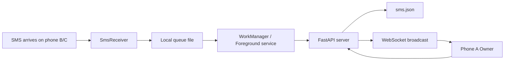

# Read SMS English Guide

This document explains Read SMS from the problem it solves to how it runs, builds, syncs, stores data, and handles known Android issues.

## 1. The Problem

The target setup uses multiple Android phones:

- Phone A is the main phone.
- Phones B and C are secondary phones that receive SMS.
- The user wants to read SMS from B/C on A without opening every phone.

Read SMS makes B/C collectors and A the owner viewer.

## 2. Why This Design

Android can allow SMS access when the user grants permission. iOS does not allow a normal third-party app to read all device SMS, so this project is Android-only.

Design choices:

- Kotlin native Android for SMS provider access, permissions, background service, and WorkManager.
- Python FastAPI for a small server that is easy to run and inspect.
- JSON file storage because the data volume is small and retention is short.
- WebSocket for owner realtime updates, with polling fallback every 5 seconds.
- Foreground service on collectors to improve reliability on aggressive Android ROMs.

## 3. System Flow



Flow details:

1. An SMS arrives on a secondary phone.
2. `SmsReceiver` catches the SMS event.
3. The Android app writes the message to a local queue first.
4. `WorkManager` or the foreground service sends queued messages to the server.
5. The server writes messages to `sms.json`.
6. The server broadcasts new messages through WebSocket.
7. The owner phone shows the message and can display a silent notification.
8. If the owner phone was offline, it fetches recent messages when opened again.

## 4. Supported Features

Android:

- Reads SMS from the last 1 day.
- Receives new SMS through a broadcast receiver.
- Uses a local queue so messages are not lost when the network is down.
- Retries sync through WorkManager.
- Uses a foreground keep-alive service for strict background restrictions.
- Restarts sync after reboot.
- Owner realtime through WebSocket.
- Owner fallback polling every 5 seconds.
- Silent owner notifications for new SMS.
- New/unread state in the owner inbox.
- Android system light/dark mode.
- Thai-friendly UI copy and typography.

Server:

- FastAPI.
- JSON storage.
- Default 1-day retention.
- API token authentication.
- WebSocket viewer.
- Runs from the project root with `python main.py`.
- Auto-creates `server\.env` with a random API token if it does not exist.

## 5. Limitations

- Android only.
- Not suited for Google Play distribution because `READ_SMS` and `RECEIVE_SMS` are sensitive permissions.
- iPhone cannot support this type of full-device SMS reading.
- If the user force-stops the Android app, Android will not restart it until the user opens it again.
- Some vendors such as Xiaomi, POCO, OPPO, realme, vivo, and Samsung may require manual battery/autostart settings.
- `sms.json` is plain JSON and is not encrypted at rest yet.
- The current APK is a debug build, not a signed production release.

## 6. Running the Server

Install dependencies once:

```powershell
pip install -r server\requirements.txt
```

Run from the project root:

```powershell
python main.py
```

If `server\.env` does not exist, the server creates it:

```text
READSMS_HOST=0.0.0.0
READSMS_PORT=9201
READSMS_RELOAD=false
READSMS_API_TOKEN=<generated-random-token>
READSMS_DB_PATH=./sms.json
READSMS_RETENTION_DAYS=1
READSMS_CORS_ORIGINS=*
```

Use these values in the Android app:

- `Server URL`: the `Phone:` URL printed by the server.
- `API token`: the `READSMS_API_TOKEN` value from `server\.env`.

Stop the server with `Ctrl+C`.

## 7. Building the Android App

From the project root:

```powershell
.\build-apk.ps1
```

APK output:

```text
android\app\build\outputs\apk\debug\app-debug.apk
```

If a phone is connected with USB debugging:

```powershell
.\install-apk.ps1
```

In Android Studio, open this folder:

```text
android
```

If Run Configuration has no module, make sure Android Studio opened the `android` folder, not the project root.

## 8. Android App Setup

Phone A:

1. Install the APK.
2. Choose `เครื่องหลัก` / Owner.
3. Enter Server URL and API token.
4. Validate and save.
5. The app loads messages and starts realtime automatically.

Phones B/C:

1. Install the APK.
2. Choose `เครื่องรอง` / Collector.
3. Enter Server URL and API token.
4. Validate and save.
5. Grant SMS permission.
6. Allow background sync or unrestricted battery.
7. Confirm that keep-alive sync is on.

## 9. Main API

Every endpoint except `/health` requires a token:

```text
Authorization: Bearer <READSMS_API_TOKEN>
```

Endpoints:

- `GET /health`
- `GET /api/validate`
- `POST /api/devices/register`
- `POST /api/sms/sync`
- `GET /api/sms/recent`
- `GET /api/sms`
- `WS /ws/viewer?token=<READSMS_API_TOKEN>`

Collector payload example:

```json
{
  "device": {
    "id": "phone_b",
    "name": "Phone B",
    "role": "collector"
  },
  "messages": [
    {
      "sms_id": "android-123",
      "sender": "ServiceName",
      "body": "Your message",
      "received_at": "2026-05-14T10:20:00+07:00",
      "sim_slot": 1,
      "direction": "inbox"
    }
  ]
}
```

## 10. Storage

The server stores data in:

```text
server\sms.json
```

Default retention is 1 day:

```text
READSMS_RETENTION_DAYS=1
```

The server purges messages older than the retention window during sync/query operations.

## 11. Problems Encountered and Fixes

Duplicate server processes:

- Cause: uvicorn reload created a reloader process.
- Fix: default `READSMS_RELOAD=false`.

Unwanted `.venv` or package downloads:

- Fix: the server does not create a virtual environment automatically.
- If packages are missing, it prints `pip install -r server\requirements.txt`.

AndroidX build failure:

- Fix: `android.useAndroidX=true` in `android\gradle.properties`.

POCO/Xiaomi SMS or background sync issues:

- App fix: foreground keep-alive service, WorkManager, boot receiver.
- Device fix: SMS permission, notifications, autostart, unrestricted battery.

Owner did not auto refresh or notify:

- Fix: WebSocket reconnect, polling fallback, and silent notification channel.

Hardcoded secrets:

- Fix: no real token is embedded in source or README.
- `server\.env` is ignored and is generated with a random token when missing.

UI readability:

- Fix: owner inbox/conversation layout, unread/new state, and light/dark theme support.

## 12. Security Guidance

- Do not commit `server\.env`.
- Do not commit `server\sms.json`.
- Do not share your API token.
- Do not share an APK configured with your real token.
- Use a trusted Wi-Fi network.
- If exposed to the internet, add HTTPS, a reverse proxy, token rotation, and encryption-at-rest.
- Make it clear to the phone owner that the collector is syncing SMS.

More details: [Security and privacy](SECURITY.md)

## 13. Useful Commands

Run server tests:

```powershell
cd server
python -m unittest discover -s tests
```

Build APK:

```powershell
.\build-apk.ps1
```

Scan source for sensitive terms:

```powershell
rg -n --hidden "token|secret|password|api_key|authorization|bearer" -g "!android/app/build/**" -g "!android/build/**" -g "!server/sms.json" -g "!server/.env"
```

## 14. Project Origin

The project started from a personal need: multiple Android phones receive SMS, but the user wants to view them from one main phone in realtime without depending on an external service, a large database, or a complicated setup.

The first goal was simple:

- Android reads SMS and syncs it.
- Python receives and stores messages.
- JSON keeps data locally.
- Owner mode views messages in realtime.

Later improvements added queueing, retry, foreground service support, unread state, light/dark mode, documentation, and security cleanup.
