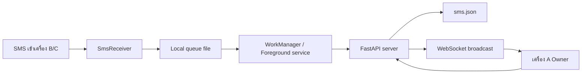

# Read SMS คู่มือภาษาไทย

เอกสารนี้อธิบาย Read SMS ตั้งแต่เหตุผลที่สร้าง วิธีทำงาน วิธีรัน วิธี build ไปจนถึงข้อจำกัดที่ควรรู้

## 1. ปัญหาที่โปรเจกต์นี้แก้

กรณีใช้งานจริงคือมีมือถือหลายเครื่อง:

- เครื่อง A คือเครื่องหลัก ใช้ดูข้อความ
- เครื่อง B และ C คือเครื่องรอง มี SMS เข้าเครื่องเหล่านี้
- ผู้ใช้ต้องการดู SMS ของ B/C จากเครื่อง A โดยไม่ต้องหยิบทุกเครื่องขึ้นมาเปิด

Read SMS จึงทำให้เครื่อง B/C อ่าน SMS ของตัวเอง แล้วส่งเข้า server ส่วนเครื่อง A เปิดแอปเพื่อดูข้อความรวมกัน

## 2. เหตุผลที่ออกแบบแบบนี้

Android อนุญาตให้แอปอ่าน SMS ได้เมื่อผู้ใช้กดอนุญาต permission เอง แต่ iOS ไม่เปิดให้แอปทั่วไปอ่าน SMS ทั้งเครื่องได้ ดังนั้นโปรเจกต์นี้จึงเน้น Android เท่านั้น

แนวทางที่เลือก:

- ใช้ Kotlin Native Android เพราะต้องเข้าถึง SMS provider, permission, background service และ WorkManager
- ใช้ Python FastAPI เพราะรันง่าย อ่านง่าย และเหมาะกับโปรเจกต์ส่วนตัว
- ใช้ JSON file storage เพราะข้อมูลไม่เยอะ เก็บแค่ช่วงสั้น ๆ และไม่ต้องติดตั้ง database
- ใช้ WebSocket สำหรับ Owner realtime และมี polling สำรองทุก 5 วินาที
- ใช้ foreground service ฝั่ง Collector เพื่อช่วยให้มือถือบางยี่ห้อไม่ฆ่างานเบื้องหลังง่ายเกินไป

## 3. ภาพรวมการทำงาน



รายละเอียด flow:

1. SMS เข้าเครื่องรอง B/C
2. `SmsReceiver` รับ event SMS ใหม่
3. แอปบันทึก SMS ลง queue ในเครื่องก่อน เพื่อกันเน็ตหลุด
4. `WorkManager` หรือ foreground service ส่ง queue เข้า server
5. Server บันทึกลง `sms.json`
6. Server broadcast ข้อความใหม่ผ่าน WebSocket
7. เครื่องหลัก A แสดงข้อความใหม่และแจ้งเตือนแบบไม่มีเสียง
8. ถ้า A ไม่ได้ออนไลน์ เปิดแอปใหม่จะดึงข้อความล่าสุดจาก API

## 4. สิ่งที่รองรับ

ฝั่ง Android:

- อ่าน SMS ย้อนหลัง 1 วัน
- รับ SMS ใหม่ผ่าน broadcast receiver
- local queue กันข้อความหายตอนเน็ตหลุด
- sync retry และ backfill ผ่าน WorkManager
- alarm watchdog ทุก 15 นาทีเพื่อช่วยปลุก collector บนเครื่องที่ชอบ kill background
- foreground keep-alive service สำหรับเครื่องที่ kill background ง่าย
- เริ่มใหม่หลัง reboot
- Owner realtime ผ่าน WebSocket
- Owner fallback polling ทุก 5 วินาที
- Owner notification แบบไม่มีเสียง
- unread/new state ในหน้า Owner
- light/dark mode ตามระบบ Android
- UI ภาษาไทยที่อ่านง่ายขึ้น

ฝั่ง server:

- FastAPI
- JSON storage
- retention default 1 วัน
- token auth
- WebSocket viewer
- รันจาก root ได้ด้วย `python main.py`
- สร้าง `server\.env` พร้อม token สุ่มให้เองถ้ายังไม่มี

## 5. สิ่งที่ไม่รองรับหรือควรรู้ก่อนใช้

- Android only
- ไม่เหมาะกับ Play Store เพราะ permission `READ_SMS` และ `RECEIVE_SMS` เป็น permission อ่อนไหว
- iPhone อ่าน SMS ทั้งเครื่องแบบนี้ไม่ได้
- ถ้าผู้ใช้กด Force stop แอป Android จะไม่ปลุกแอปขึ้นเองจนกว่าจะเปิดใหม่
- มือถือบางยี่ห้อ เช่น Xiaomi, POCO, OPPO, realme, vivo, Samsung ต้องตั้งค่า battery/autostart เพิ่ม
- ตอนนี้ `sms.json` ยังเป็น plain JSON ไม่ได้ encryption-at-rest
- Debug APK ยังไม่ใช่ release APK สำหรับแจก production จริง

## 6. วิธีรัน server

ติดตั้ง dependency ครั้งเดียว:

```powershell
pip install -r server\requirements.txt
```

รันจาก root โปรเจกต์:

```powershell
python main.py
```

ถ้าไม่มี `server\.env` ระบบจะสร้างให้เอง:

```text
READSMS_HOST=0.0.0.0
READSMS_PORT=9201
READSMS_RELOAD=false
READSMS_API_TOKEN=<generated-random-token>
READSMS_DB_PATH=./sms.json
READSMS_RETENTION_DAYS=1
READSMS_CORS_ORIGINS=*
```

ค่าที่ต้องเอาไปใส่ใน Android app คือ:

- `Server URL`: URL บรรทัด `Phone:` ที่ server แสดง
- `API token`: ค่า `READSMS_API_TOKEN` ใน `server\.env`

หยุด server ด้วย `Ctrl+C`

## 7. วิธี build Android

จาก root โปรเจกต์:

```powershell
.\build-apk.ps1
```

APK จะอยู่ที่:

```text
android\app\build\outputs\apk\debug\app-debug.apk
```

ถ้าต่อมือถือและเปิด USB debugging:

```powershell
.\install-apk.ps1
```

เปิดใน Android Studio ให้เปิดโฟลเดอร์:

```text
android
```

ถ้า Run Configuration ไม่มี module ให้เช็คว่าเปิดโฟลเดอร์ `android` ไม่ใช่ root โปรเจกต์

## 8. วิธีตั้งค่าแอป

เครื่อง A:

1. ติดตั้ง APK
2. เลือก `เครื่องหลัก`
3. ใส่ Server URL และ API token
4. กดตรวจสอบและบันทึก
5. แอปจะโหลดข้อความและเปิด realtime ให้อัตโนมัติ

เครื่อง B/C:

1. ติดตั้ง APK
2. เลือก `เครื่องรอง`
3. ใส่ Server URL และ API token
4. กดตรวจสอบและบันทึก
5. อนุญาตอ่าน SMS
6. อนุญาต background sync หรือ battery unrestricted
7. ดูสถานะ `ซิงก์ตลอดเวลา` ให้เป็น `เปิด`

## 9. API หลัก

ทุก endpoint ยกเว้น `/health` ต้องมี token

```text
Authorization: Bearer <READSMS_API_TOKEN>
```

Endpoints:

- `GET /health`
- `GET /api/validate`
- `POST /api/devices/register`
- `POST /api/sms/sync`
- `GET /api/sms/recent`
- `GET /api/sms`
- `WS /ws/viewer?token=<READSMS_API_TOKEN>`

ตัวอย่าง payload จาก Collector:

```json
{
  "device": {
    "id": "phone_b",
    "name": "Phone B",
    "role": "collector"
  },
  "messages": [
    {
      "sms_id": "android-123",
      "sender": "ServiceName",
      "body": "Your message",
      "received_at": "2026-05-14T10:20:00+07:00",
      "sim_slot": 1,
      "direction": "inbox"
    }
  ]
}
```

## 10. ข้อมูลเก็บที่ไหน

Server เก็บข้อมูลใน:

```text
server\sms.json
```

ค่า default คือเก็บ SMS สูงสุด 1 วัน:

```text
READSMS_RETENTION_DAYS=1
```

เมื่อมีการเรียก API sync/query ระบบจะ purge ข้อความที่เก่ากว่า retention ทิ้ง

## 11. ปัญหาที่เคยเจอและวิธีแก้ในโปรเจกต์

เปิด server แล้ว process ซ้อน:

- สาเหตุ: uvicorn reload ทำให้มี reloader process
- แก้: ค่า default `READSMS_RELOAD=false`

ไม่อยากให้สร้าง `.venv` หรือดาวน์โหลด package เอง:

- แก้: server ไม่สร้าง venv อัตโนมัติ
- ถ้าขาด package จะแจ้งให้รัน `pip install -r server\requirements.txt` เองครั้งเดียว

Android build ไม่ผ่านเพราะ AndroidX:

- แก้: `android.useAndroidX=true` ใน `android\gradle.properties`

POCO/Xiaomi อ่าน SMS หรือ sync เบื้องหลังไม่เสถียร:

- แก้ในแอป: ใช้ foreground keep-alive service, WorkManager backfill, alarm watchdog, boot receiver
- แก้ในเครื่อง: เปิด SMS permission, notification, autostart และ battery unrestricted

ถ้า POCO C65 ผ่านไปหลายชั่วโมงแล้วไม่ sync:

- ติดตั้ง APK ล่าสุด เพราะเวอร์ชันใหม่ให้ WorkManager อ่าน SMS ล่าสุด 1 วันเอง ไม่ใช่แค่ส่งคิวค้าง
- เปิดแอปหนึ่งครั้งหลังติดตั้ง แล้วเลือก `เครื่องรอง`
- กด `ดึง SMS 1 วันล่าสุด` เพื่อ seed คิวครั้งแรก
- เช็คว่า notification `ReadSMS Collector is running` ขึ้นหลังเปิด keep-alive
- อย่ากด Force stop แอป เพราะ Android จะไม่ปลุก receiver, worker หรือ alarm จนกว่าจะเปิดแอปเอง
- ถ้า notification หายไป เครื่องอาจ kill service แล้ว แต่ watchdog/WorkManager ควรดึงย้อนหลังเมื่อระบบปล่อยให้ทำงาน

Owner ไม่ auto refresh หรือไม่แจ้งเตือน:

- แก้: เพิ่ม WebSocket auto reconnect, polling fallback และ notification channel แบบไม่มีเสียง

UI อ่านยาก:

- แก้: ปรับ Owner ให้คล้าย inbox/conversation, เพิ่ม unread/new state และรองรับ light/dark mode

Hardcoded secrets:

- แก้: ไม่ฝัง token จริงใน source หรือ README
- `server\.env` ถูก ignore และสร้าง token สุ่มเมื่อไม่มีไฟล์

## 12. แนวทางความปลอดภัย

- อย่า commit `server\.env`
- อย่า commit `server\sms.json`
- อย่าแชร์ API token
- อย่าแชร์ APK ที่ถูกตั้งค่าด้วย token จริง
- ใช้บน Wi-Fi ที่ไว้ใจได้
- ถ้าเปิดออก internet ต้องเพิ่ม HTTPS, reverse proxy, token rotation และ encryption-at-rest
- แสดงให้เจ้าของเครื่องรู้ชัดเจนว่าแอปกำลัง sync SMS

อ่านรายละเอียดเพิ่ม: [Security and privacy](SECURITY.md)

## 13. คำสั่งตรวจสอบ

รัน test ฝั่ง server:

```powershell
cd server
python -m unittest discover -s tests
```

build APK:

```powershell
.\build-apk.ps1
```

ตรวจหาคำที่อาจเป็น secret ใน source:

```powershell
rg -n --hidden "token|secret|password|api_key|authorization|bearer" -g "!android/app/build/**" -g "!android/build/**" -g "!server/sms.json" -g "!server/.env"
```

## 14. จุดเริ่มต้นของโปรเจกต์

โปรเจกต์เริ่มจากความต้องการส่วนตัว: มีมือถือหลายเครื่องและอยากอ่านข้อความ SMS จากเครื่องรองบนเครื่องหลักแบบ realtime โดยไม่ใช้ service ภายนอก ไม่ต้องมี database ใหญ่ และรันง่ายบนเครื่อง Windows ส่วนตัว

จึงออกแบบให้เรียบง่ายก่อน:

- Android อ่าน SMS และ sync
- Python server รับข้อมูล
- JSON เก็บข้อมูล
- Owner ดูข้อความและรับ realtime

หลังจากนั้นจึงเพิ่มสิ่งที่จำเป็นต่อการใช้งานจริง เช่น queue, retry, foreground service, unread state, dark/light mode, README, และ security cleanup
